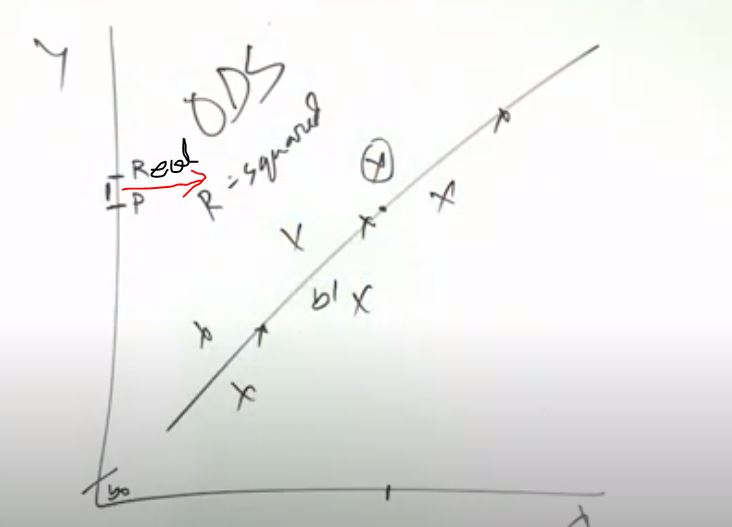
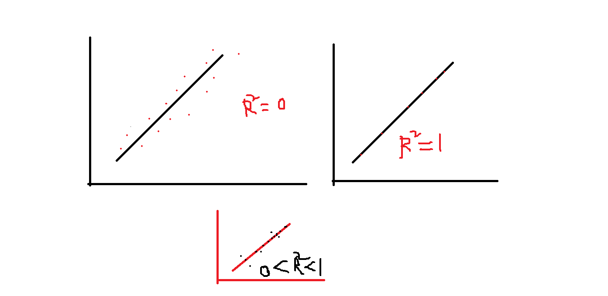

<strong> Linear Regression:</strong>
   

 
Linear Regression is a supervised machine learning algorithm where the predicted output is continuous and has a constant slope. It’s used to predict values within a continuous range.
  
Rule: y = b0 + b1 x
   
 
  

After fitting a linear regression model, you need to determine how well the model fits the data. 
R-squared is a goodness-of-fit measure for linear regression models. 

 
সুত্রঃ r^2 = 1- (sum_Of_all_Errors / some_of_squre_varient_of_mean)

      
<strong> Polynomial regression:</strong>
   

