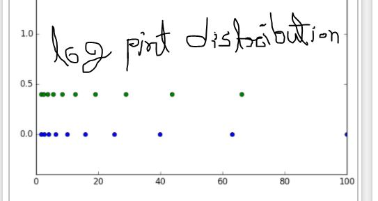

python libraries for machine learning
 
1. NumPy (নামপি) 
2.matplatlib 
3.SciPy 
etc. 

    code / commands:   
1.NumPy: (NumPy হল একটি linear algebra library , fast calulate) 
to check numpy is instaled or not? :  !pip install numpy 
if not then :   pip install numpy 
to import and use numpy library : import numpy as np  # np == numpy 
 
 

arr=np.array([1,2,3,4])  #creating numpy array
 
or,
 
if we make a nested array: then,   

puthon_list=[[1,2,3,4],[6,7,8,9]] 
arr=np.array(python_list) 
here the out put will be like a matrix  
  
####Now, 
'arange' a function in numpy libreries.  
it usded to make numpy array in a range of numbers. 
now, arange has 3 parameters. 
(start,end, step_size)  
if step size is not given the default is 1 
 
 
arrr=np.arange(0,10,2) 
arrr 
 
 
যদি  এমন একটা matrix বানাতে হই যেখানে matrix এর সব ০ তাহলে, function আছে, 'zeros' যেখানে ২ টা parameter আছে. parameter হিসেবে যদি ১টা নাম্বার দেই, যেমন ৫, তাহলে সুধু ৫টা ০ দিয়ে row matrix বানাবে 

যদি ২টা parameter ইই দেই তবে ১ম টা row , পরের টা column. 
তবে ২তাইই ((row, column )) double ব্রাকেট এর মদ্ধে থাকবে।  
print(np.zeros(5)) 
print() 
np.zeros((3,4))   

তবে এখানে সব floating point এ আছে।
 
ইন্তেগের করতে হোলে 
np.zeros((4,3),dtype="int" )    

এখন, 'zeros' এর মত 'ones' একটা function আছে। 

np.ones((4,3))    

আরেক টা function আছে 'full' 
np.full((row,column), 10) 
তাহলে row, column সব ১০ দারা fill হবে   
np.full((3,4), 10) 
or,  
1d matrix এর জন্ন  
np.full(5, 10)    
   

identity matrix: 
eye(row) 
  
output:  
array([[1., 0., 0., 0.],
       [0., 1., 0., 0.],
       [0., 0., 1., 0.],
       [0., 0., 0., 1.]])

   
এখন একটি গুরুত্তপুরন function:
 
<strong>'linspace'</strong>
 
np.linspace(start,end, divide)
এখানে start= 0 হোলে এবং end=10 হোলে এবং divide=5 হোলে, 
০ থেকে ১০ এর মধ্যে ৫ ভাগে ভাগ হয়ে  
[0. , 2.5 , 5. , 7.5 , 10. ]
 
বেপারটা এমন যে, 
একটা সরল রেখা আক্তে হবে যার স্থানাঙ্ক ০ থেকে ১০
 
এখন এর মধ্যে সমান ৫ টা পয়েন্ট বের করতে হবে। তাহলে point গুলা হবে ঃ  
np.linspace(০,১০,৫)  
[0. , 2.5 , 5. , 7.5 , 10. ] 

  
code: np.linspace(-1,1,10)  
output:array([-1.        , -0.77777778, -0.55555556, -0.33333333, -0.11111111, 0.11111111,  0.33333333,  0.55555556,  0.77777778,  1.        ])

    
এবার log_space দিয়ে evenly distribution
  <strong> 'logspace' function</strong> 
'linspace' এর মতইই just extra একটা পারামেটার আছে function  এ , 'base'  
যেটা , result কত base Log দেখতে চাচ্ছি তা নির্দেশ করে or, exp এও দেখা যাবে 
আর এই পারামেটার ছাড়া হোলে by default base 10 এএ দেখাবে
  
np.logspace(0,10,5) # here,(log_base 10) base =10 
np.logspace(0,10,5, base =2) # here,(log_base 2) base =2 
np.logspace(0,10,5, base =np.e ) # here,(log_base epsilon) base =epsilon  

 
log_space_point_distribution.JPG
   