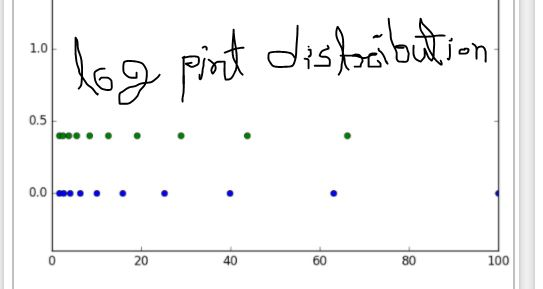
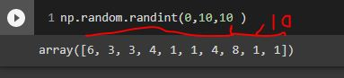
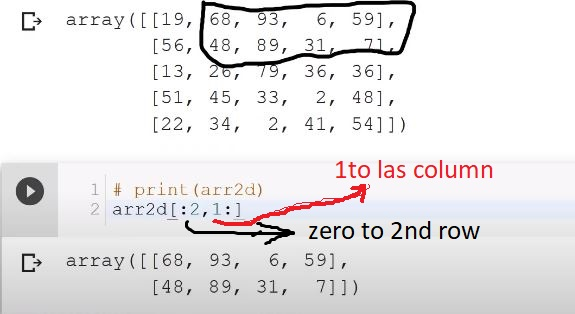

python libraries for machine learning
 
1. NumPy (নামপি) 
2.matplatlib 
3.SciPy 
etc. 

    code / commands:   
1.NumPy: (NumPy হল একটি linear algebra library , fast calulate) 
to check numpy is instaled or not? :  !pip install numpy 
if not then :   pip install numpy 
to import and use numpy library : import numpy as np  # np == numpy 
 
 

arr=np.array([1,2,3,4])  #creating numpy array
 
or,
 
if we make a nested array: then,   

puthon_list=[[1,2,3,4],[6,7,8,9]] 
arr=np.array(python_list) 
here the out put will be like a matrix  
  
####Now, 
'arange' a function in numpy libreries.  
it usded to make numpy array in a range of numbers. 
now, arange has 3 parameters. 
(start,end, step_size)  
if step size is not given the default is 1 
 
 
arrr=np.arange(0,10,2) 
arrr 
 
 
যদি  এমন একটা matrix বানাতে হই যেখানে matrix এর সব ০ তাহলে, function আছে, 'zeros' যেখানে ২ টা parameter আছে. parameter হিসেবে যদি ১টা নাম্বার দেই, যেমন ৫, তাহলে সুধু ৫টা ০ দিয়ে row matrix বানাবে 

যদি ২টা parameter ইই দেই তবে ১ম টা row , পরের টা column. 
তবে ২তাইই ((row, column )) double ব্রাকেট এর মদ্ধে থাকবে।  
print(np.zeros(5)) 
print() 
np.zeros((3,4))   

তবে এখানে সব floating point এ আছে।
 
ইন্তেগের করতে হোলে 
np.zeros((4,3),dtype="int" )    

এখন, 'zeros' এর মত 'ones' একটা function আছে। 

np.ones((4,3))    

আরেক টা function আছে 'full' 
np.full((row,column), 10) 
তাহলে row, column সব ১০ দারা fill হবে   
np.full((3,4), 10) 
or,  
1d matrix এর জন্ন  
np.full(5, 10)    
   

identity matrix: 
eye(row) 
  
output:  
array([[1., 0., 0., 0.], 
       [0., 1., 0., 0.], 
       [0., 0., 1., 0.], 
       [0., 0., 0., 1.]]) 

   
এখন একটি গুরুত্তপুরন function:
 
<strong>'linspace'</strong>
 
np.linspace(start,end, divide)
এখানে start= 0 হোলে এবং end=10 হোলে এবং divide=5 হোলে, 
০ থেকে ১০ এর মধ্যে ৫ ভাগে ভাগ হয়ে  
[0. , 2.5 , 5. , 7.5 , 10. ]
 
বেপারটা এমন যে, 
একটা সরল রেখা আক্তে হবে যার স্থানাঙ্ক ০ থেকে ১০
 
এখন এর মধ্যে সমান ৫ টা পয়েন্ট বের করতে হবে। তাহলে point গুলা হবে ঃ  
np.linspace(০,১০,৫)  
[0. , 2.5 , 5. , 7.5 , 10. ] 

  
code: np.linspace(-1,1,10)  
output:array([-1.        , -0.77777778, -0.55555556, -0.33333333, -0.11111111, 0.11111111,  0.33333333,  0.55555556,  0.77777778,  1.        ])

    
এবার log_space দিয়ে evenly distribution
  <strong> 'logspace' function</strong> 
'linspace' এর মতইই just extra একটা পারামেটার আছে function  এ , 'base'  
যেটা , result কত base Log দেখতে চাচ্ছি তা নির্দেশ করে or, exp এও দেখা যাবে 
আর এই পারামেটার ছাড়া হোলে by default base 10 এএ দেখাবে
  
np.logspace(0,10,5) # here,(log_base 10) base =10 
np.logspace(0,10,5, base =2) # here,(log_base 2) base =2 
np.logspace(0,10,5, base =np.e ) # here,(log_base epsilon) base =epsilon  

 

   
    
<strong> diagonal matrix making function 'diag':</strong> 
code: np.diag([1,2,3])
output: array([[1, 0, 0],
              [0, 2, 0],
              [0, 0, 3]])

   
<strong>Random Number: </strong> 
random number generating function 
np.random.rand(4) #1d matrix 
np.random.rand(4,3) #2d matrix 
np.random.rand(4,4,4) #3d matrix 

code: 
print(np.random.rand(4)) #1d matrix 
print("") 
print("") 
print(np.random.rand(2,2)) #2d matrix 
print("") 
print("") 
print(np.random.rand(2,2,2)) #3d matrix) 
print("") 
print("")  

output:  
[0.47174969 0.61137453 0.50886639 0.36165707] 
  

[[0.55637462 0.30024987] 
 [0.4895491  0.73093113]] 

  
[[[0.7173619  0.61072548] 
  [0.93320895 0.89540955]] 

 [[0.41259348 0.95140771] 
  [0.50621412 0.76924433]]] 

   
   
<strong> make array of random integer numbers:</strong> 
  sample: 
np.random.randint(lower limit,lower limit +1 ,কয় টা সংখ্যা লাগবে )
  np.random.randint(0,10,10 )  
  
 
 
  

# now
we can reshape the matrix. By 'reshape()'
 

#### code:
arr=np.random.randint(0,10,10 ) 
arr # first making a 1d matrix 
arr.reshape(2,5) #re shape the array  
#### output:
array([8, 9, 1, 6, 0, 8, 7, 0, 1, 2])   
array([[8, 9, 1, 6, 0], 
       [8, 7, 0, 1, 2]]) 

### or
#### code:
arr=np.random.randint(0,10,(4,3) ) 
print(arr) # first making a 1d matrix 
#re shape the array 
print()  
print()  
arr= arr.reshape(2,6) 
print(arr)  
#### output:
[[7 6 0] 
 [9 1 9] 
 [4 8 2] 
 [8 2 6]] 
  

[[7 6 0 9 1 9] 
 [4 8 2 8 2 6]] 

  

### more use of re shape or reshape
### code:
arr = np.arange(1,13).reshape(4,3) 
arr2 = np.arange(1,13).reshape(4,3) 
print(arr) 
### output:
[[ 1  2  3]
 [ 4  5  6]
 [ 7  8  9]
 [10 11 12]]

   

### এখন matrix এর মধ্যে ম্যাক্সিমাম value or minumum value or max vlue টা আমার কথায় আছে (index of max value) :
 

#### code:
arr=np.random.randint(0,10,(2,6) ) # making a random matrix 
print(arr) 
print() 
print ('max: ',arr.max()) #finds maximum number in the array 
print ('index :' ,arr.argmax()) #finds the index of maximum number in the array 
print("",end="\n\n") 
print ('min: ',arr.min()) #finds min number in the array 
print ('index :' ,arr.argmin()) #finds the index of mim number in the array 
#### output:
[[8 0 1 8 7 7] 
 [5 4 4 9 7 5]] 
  
max:  9 
index : 9 
min:  0 
index : 0 
  

### matrix shape finding / কয় dimention array(1d,2d,3d)?
arr=np.random.randint(0,10,(2,6) ) # making a random matrix 
arr.shape ## shape finding 

arr.ndim  #কয় dimention array(1d,2d,3d)? 

arr.size  #total elements 
  

### data type of a matrix elements
arr=np.random.randint(0,10,(2,6) ) 
arr.dtype 
arr=np.random.rand(2,6) 
arr.dtype 
 
<strong>access a value from 2d matrix</strong>
arr[2][2] 
অথবা, 
arr[2,2] 

  

### equals to in numpy
#### arr2 = arr  #এটা copy হই না । address pass হই
  

## to copy array : 

### arr2 =arr.copy()

  

## selection (select a part of a matrix and make sub matrix):
  

#### input:
arr=np.random.randint(0,10,(5,7) ) 
print(arr) 
print() 
arr[:2,1:] 

#### output:
[[6 5 2 0 0 4 2] 
 [4 8 8 5 7 6 2] 
 [4 7 7 8 6 2 0] 
 [5 0 7 6 3 2 0] 
 [0 4 5 9 7 5 2]] 

array([[5, 2, 0, 0, 4, 2], 
       [8, 8, 5, 7, 6, 2]]) 
       

## selection (conditional selection):
  
arr=np.random.randint(0,10,(5,7) ) 
print(arr) 
print() 
print(arr>4) 
print() 
print(arr[arr>4]) 
   

### here we can find the all function about numpy arithmatic operations: 
<a src="## https://docs.scipy.org/doc/numpy/reference/ufuncs.html">## https://docs.scipy.org/doc/numpy/reference/ufuncs.html </a>
   

## arethmatic sum of 2 matrix
 

#### code:
arr=np.random.randint(0,10,(5,7) ) 
print(arr) 
print() 
print(arr+arr) 
#### output:
[[5 7 9 6 1 7 3] 
 [3 4 5 3 3 3 5] 
 [3 1 0 9 1 3 7] 
 [5 6 8 9 0 4 3] 
 [6 5 2 9 4 0 2]] 

[[10 14 18 12  2 14  6] 
 [ 6  8 10  6  6  6 10] 
 [ 6  2  0 18  2  6 14] 
 [10 12 16 18  0  8  6] 
 [12 10  4 18  8  0  4]] 
  
 same vabe '-', '*', '/'  kora jay
   
  more use:  
 arr = np.arange(1,13).reshape(4,3)  
arr2 = np.arange(0,12).reshape(4,3)  
  
print(arr/arr2)  
 
    

